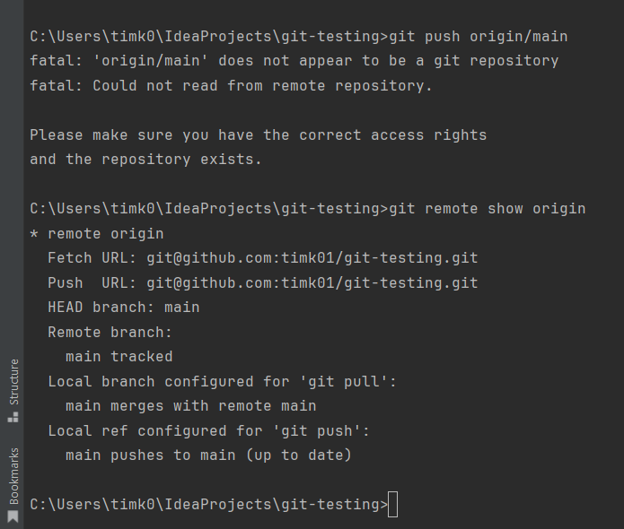
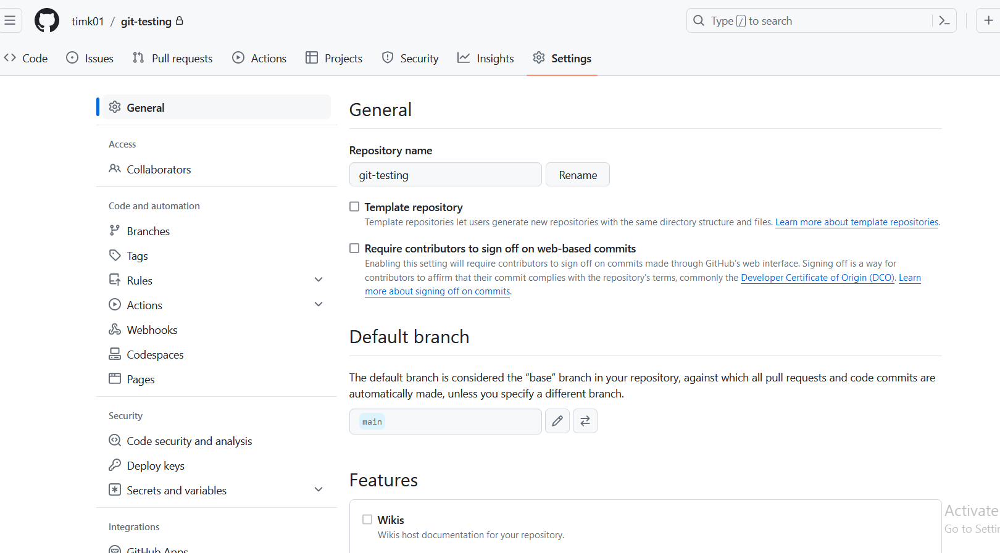
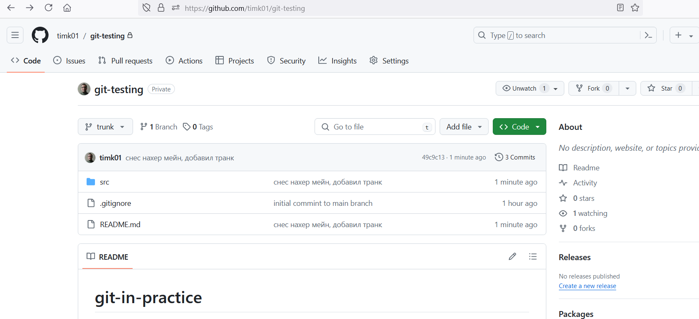
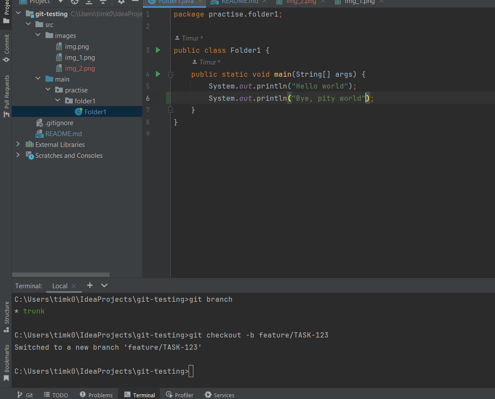
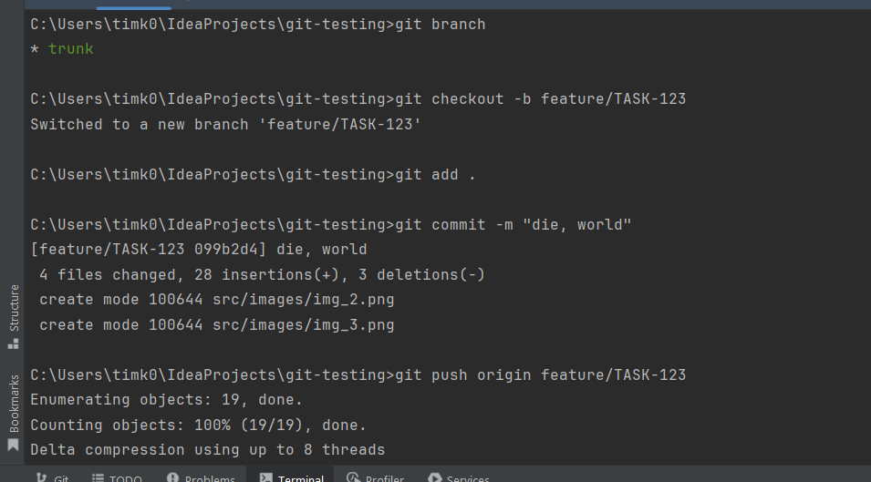
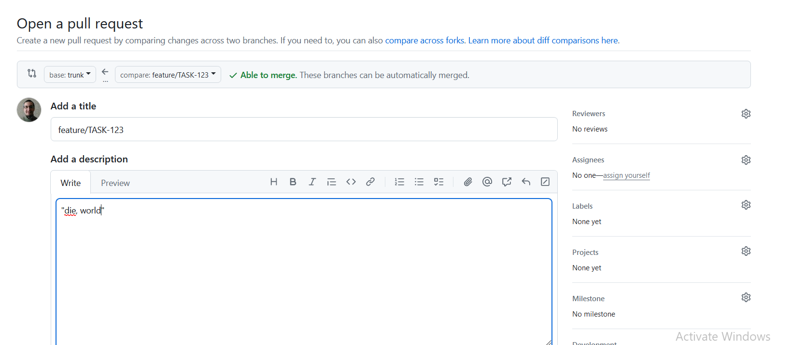
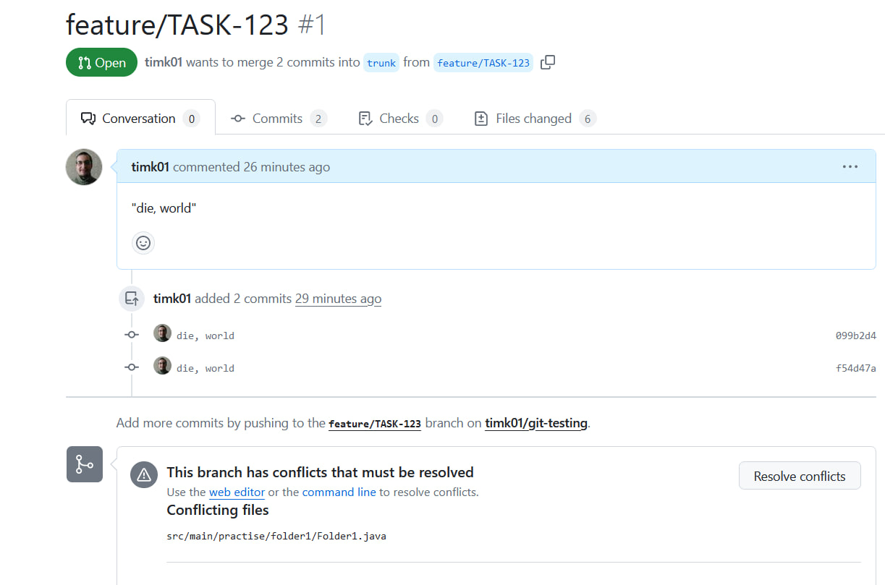
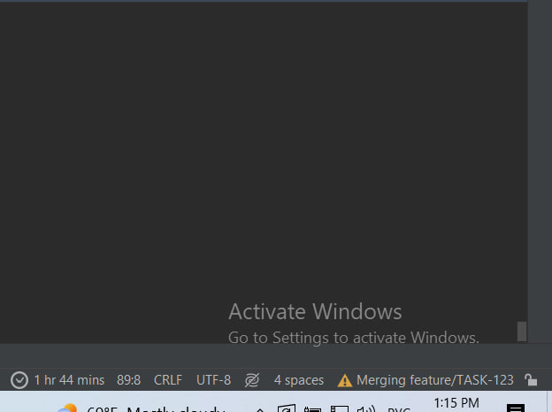

# git-in-practice

[TBD](https://trunkbaseddevelopment.com/#one-line-summary), [CI](https://martinfowler.com/articles/continuousIntegration.html), проектирование и декомпозиция - всё это помогает нам лучше и быстрее разрабатывать и приносить пользу клиентам.

TL;DR: тесты, автоматизация, декомпозиция - частые мёрджи с полной уверенностью, что основная ветка в стабильном состоянии

_Дисклеймер. Стал вставлять картинками отдельно, так что можно скроллить если что знакомо и уже "нюхалю пороху"._  

## Стандартный флоу работы

Мейн:
Создать удаленно репо   
или если он уже есть - скопировать существующий:  
`git@github.com:timk01/git-testing.git`  
(file->new->from version control)
либо через клон

### Далем изменния

Сейчас я нахожусь на ветке мейн по-умолчанию:
`git remote show origin `  


### запомнить как отче наш:

`git add .` - добавляет все файлы к отслеживаемым (есть несколько категорий, новые, измененные и неотслеживаемые)    
`git commit -m "commit description"  ` - с осмысленным коммитов (помним что 123 или фывапролдж - это ни о чем)  
`git push origin main` - пушим на удаленный репо в мейн (ориджин мейн - условно можно понимать как составное имя)  
возможно, придется убидеться что есть доступ/пароли  

Теперь. Как посмотреть ветки?  
`git branch (текущая ветка - будет мейн если не создавал иную)`  
`git branch -r (удаленные ветки) `     
`git remote -v (настройки удаленного репо, откуда фетчить, куда пушить)`      

### Переименование главной ветки (локально, уадленно)
`git branch -m main trunk (local repo rename)`  
`git push origin trunk (пушим обратно)`  
здесь он вообще предложит создать мр, но - нафиг оно (об этом позже)  
  
так переименовывать ветку. switch branch to another trunk --> yes (or kinda) - выбираем транк  
https://docs.github.com/en/repositories/configuring-branches-and-merges-in-your-repository/managing-branches-in-your-repository/changing-the-default-branch  
`git push origin --delete main (так сносим удаленную ветку)`  
так как удаленную ветку мы снесли, изменения чуть подвисли  
-- надо их запушить  (3 команды выше)  


### Создаём ветку (обычно)
_здесь процесс подробен, дабы не повторять его потом_  
`git checkout -b feature/TASK-123`  
  
  
  
эмулируем конфликт -- переключимся в мейн и то-нибудь там изменим (в реальной работе, например, кто-то что-то смерджил туда ДО нас - например слили оередной МР)  
  
пуш-мр  
  
-- здесь изменения есть в главной ветке, но в нашей их нет:  
    
    
- так идея предлагает это разруливать (не на ГХ, думаем что у нас сложный конфликт и идея сама не знает что с ним делать)  
кстати да, обращаю внимание что картинки из мейна с картинками здесь не конфликтуют (и ридмишка тоже, т.к. изменения я в мейне не вносил) - то есть это только ОБЩИЕ файлы  
  
- пуллим, но здесь идея сама уже все за нас решила и мы пропустили много шагов  
  
- а именно, идея сама умная и мерджит за нас  
  
- решаем конфликты сами, фиксируем изменения    
адд, мр, пуш  
   
-- итого    
(здесь, правда, конфликт простой, но уже можно увидеть почему оно вообще происходит и что с этим делать, да)  

### Создаём ветку (чуть вернее)
_здесь и далее то, что происходило в лекции_   
убеждаемся что мы все еще на транке:  
`git branch`
```bash
git checkout -b feature/TASK-123 --no-track origin/trunk
```
`git checkout -b feature/TASK-123 origin/trunk` 
(это создать ветку стандартно (потому и Б) но - **НО на основе удаленной ветки**)  
(сравни с `git checkout -b feature/TASK-123` - где **просто на основе какой-то** (при этом не обязательно мейна) ветки

теперь - ПОЧЕМУ это важно. а все потому что есть конфликты, в том числе и мы создаем на основе свежайшей (и нецелованной) как слеза юной девы, удаленной ветки  
с точки зрения репо - мы будем работать с последними изменениями, а так как мы предполагаем что удаленный транк - самый последний, это существенно меньше возни в дальнейшей  

теперь - что за зверь `--no-track`  
ноутрак главным образом - так и работает как "не отслежвать" - то есть у нас теперь ветка, которя никак не синхронизируется с главной и вообще про нее не знает  
что уменьшает конфликты, не нужно часто сливать/слиять (мерж/ребейз) и превращает векту в ту самую сильную и независимую, которая все делает сама

_короче, с точки зрения транк-разработки - самое оно (но не без минусов, потому что сами можем наворотить делов)_  

### Создаём ветку в origin  
```bash
git push -u origin $(git branch --show-current)
```
`$(команда)` - это типа подзапроса в скуэле, сначала выполнится он  
_напомню, что мы уже сделали изменения к этому моменту и зафиксировали их_  
сама `$(git branch --show-current)` вернет ни что иное как текущую ветку, например так:  
  
а первая часть команды - это обычный пуш
итого, выходит что:  
`git push -u origin $(git branch --show-current)`  
эквивалентно  
`git push -u origin feature/TASK-123`  
(делается это для удобства, чтобы когда ветки называются схоже, нельзя было опечататься - тем самым снижая возможные ошибки)  

и да: полная команда в вин работать **не** будет, т.к. окошки не поддерживают прямую подстановку команд. sadface
как обходной путь, можно из баша:  

вам возможно придетс переоткрыть идею и терминал снизу, но оно - работает:


### Вносим изменения и добавляем их в отслеживаемые  
```bash
git add .
git commit -m TASK-123 Добавлена важная доработка
git push
```

### Готовим ветку к Pull Request
#### Вмёрдживаем основную ветку к себе

```bash
git fetch
git merge origin/trunk
```

#### Делаем squash (один из способов, как по мне самый простой)  
```bash
git reset --soft $(git merge-base trunk HEAD)
git commit -m "TASK-123 Добавлен один красивый коммит"
```

#### Пушим свои изменения  
```bash
git push --force-with-lease
```
Альтернативно - это можно сделать в gitlab/github, там есть функциональность squash and merge.  

## Полезные команды

#### Показать список веток.
```bash
git branch -a
```

#### Посмотреть историю коммитов в виде графика
```bash
git log --graph --oneline --decorate
```

#### Изменить описание последнего коммита
```bash
git commit --amend -m "Описание коммита"
```

#### Посмотреть изменения между текущей веткой и trunk
```bash
git diff HEAD..origin/trunk
```

#### Удалить локальную и удалённую ветку
```bash
git push origin -d <имя_ветки>
git branch -D <имя_ветки>
```

#### Установить и запушить тэг
```bash
git tag <x.y.z>
git push origin --tags
```
Дополнительно: [семантическое версионирование](https://semver.org/lang/ru/)

#### Перенести коммит из одной ветки в другую
```bash
git cherry-pick <хэш-коммита>
```

## Линейная или нелинейная история: rebase или merge?


## Попрактиковаться в git

https://learngitbranching.js.org