# git-in-practice, книжка с картинками для разработчиков разного уровня

[TBD](https://trunkbaseddevelopment.com/#one-line-summary), [CI](https://martinfowler.com/articles/continuousIntegration.html), проектирование и декомпозиция - всё это помогает нам лучше и быстрее разрабатывать и приносить пользу клиентам.

TL;DR: тесты, автоматизация, декомпозиция - частые мёрджи с полной уверенностью, что основная ветка в стабильном состоянии

_Дисклеймер. Стал вставлять картинками отдельно, так что можно скроллить если что знакомо и уже "нюхали пороху"._

Объять все части гита - нереально, целью расширения оригинального репо было потыкать самому, показать что не так страшны МР и команды гита, командная строчка и создать хороший мемориз на будущее, что полагаю мне удалось; хотя я лично предпочитаю вместо командной строчки... ЮИ

Картинок - много. Это не совсем формат стандартного ридми, если что знаем и знаем уверенно - проматываем смело.

Я не считаю себя гуру гита, но мне не хочется тратить много времени на очередное разрешение конфликта в реквесте.

Начинаем!

## Оригинал репо реален и ~~(о боже, оно существует!)~~ расположен здесь, здесь же можно смотреть коммиты, например:
https://github.com/timk01/git-testing

## Стандартный флоу работы

### Мейн:
Создать удаленно репо (я делал это через гитхаб и уже потом копировал сюда, разницы большой нет)
или если он уже есть - скопировать существующий:  
`git@github.com:timk01/git-testing.git`  
(file->new->from version control)
либо через клон и командную строчку

### Делаем изменения

Сейчас я нахожусь на ветке уже локально мейн по-умолчанию:  
`git remote show origin `  


### Запомнить как отче наш:
_Основные команды - их чуть больше (5-7 наверное ?), да и знать надо чуть больше, но вот эти 3, да пуш с пулом (о них позже) знать надо совершенно точно_

`git add .` - добавляет все файлы к отслеживаемым (есть несколько категорий, новые, измененные и неотслеживаемые; все если что выделяются цветом)    
`git commit -m "commit description"  ` - с осмысленным коммитов (помним что 123 или фывапролдж - это ни о чем)  
`git push origin main` - пушим на удаленный репо в мейн (ориджин мейн - условно можно понимать как составное имя)  
возможно, придется убидеться что есть доступ/пароли

### Работа с ветками

Порой, очень сильно облегчает задачу вкладочка снизу слева `git` и справа снизу - где `ветки` (рядом с замком) - если происходит какой-то бардак с ветками и вам сложно с командной строкой, лучше сунуться сперва сюда

`git log`  
-- лог всех изменений веток, с автором, датами, коммитом; а галвное это лог - то есть записей там много и они подробны  
(если лог большой - выходить q)  
`git status`  
-- посмотреть состояние на настоящий момент (те самые трекед/антрекед файлы, о которых говорилось ранее)

Теперь. Как посмотреть ветки отдельно ?  
`git branch (текущая ветка - будет мейн если не создавал иную)`  
`git branch -r (удаленные ветки) `     
`git remote -v (настройки удаленного репо, откуда фетчить, куда пушить)`

### Переименование главной ветки (локально, уадленно)
`git branch -m main trunk (local repo rename)`  
`git push origin trunk (пушим обратно)`  
здесь он вообще предложит создать мр, но - нафиг оно (об этом позже)  
  
так переименовывать ветку. switch branch to another trunk --> yes (or kinda) - выбираем транк  
https://docs.github.com/en/repositories/configuring-branches-and-merges-in-your-repository/managing-branches-in-your-repository/changing-the-default-branch  
`git push origin --delete main (так сносим удаленную ветку)`  
так как удаленную ветку мы снесли, изменения чуть подвисли  
-- надо их запушить  (3 команды выше); итого:  
``

### Создаём ветку (обычно)
_здесь процесс подробен, дабы не повторять его потом_  
`git checkout -b feature/TASK-123`  
    
изменения  
  
эдд-коммит-пуш  

эмулируем конфликт -- переключимся в мейн и то-нибудь там изменим (в реальной работе, например, кто-то что-то смерджил туда ДО нас - например слили оередной МР)  
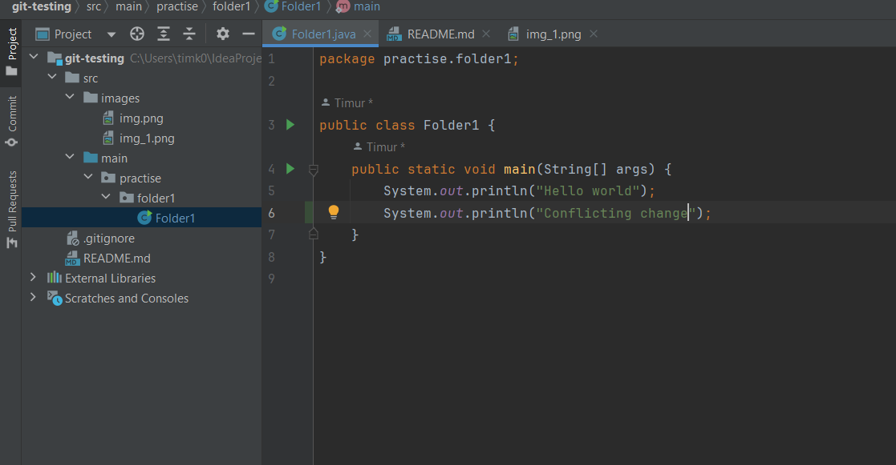  
пуш-мр  
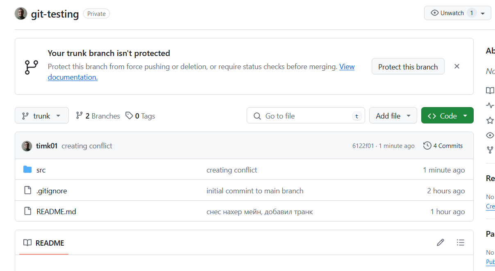  
-- здесь изменения есть в главной ветке, но в нашей их нет:  
    
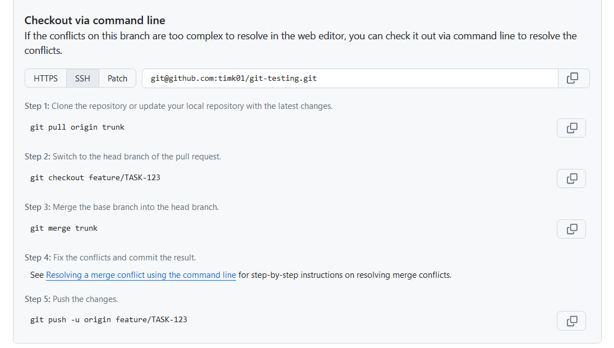
-- так идея предлагает это разруливать (делаем это не на ГХ, думаем что у нас сложный конфликт и идея сама не знает что с ним делать)  
кстати да, обращаю внимание что картинки из мейна (транк) с картинками здесь не конфликтуют (и ридмишка тоже, т.к. изменения я в мейне не вносил) - то есть это только ОБЩИЕ конфликтующие файлы  
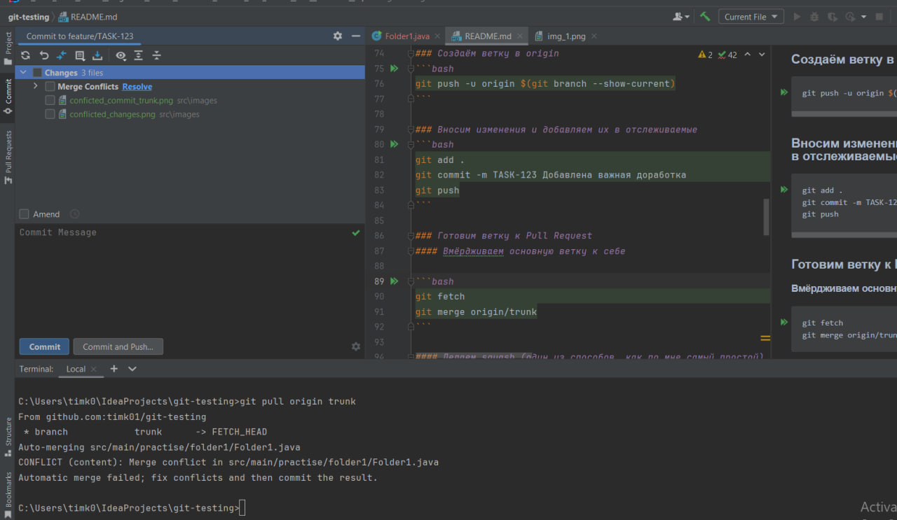
-- пуллим, но здесь идея сама уже все за нас решила и мы пропустили много шагов (смотри далее разницу между мерджем и ребейзом)    

-- а именно, идея сама умная и мерджит за нас  
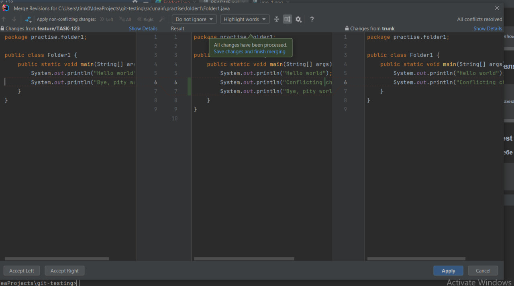  
-- решаем конфликты сами, фиксируем изменения    
адд, мр, пуш  
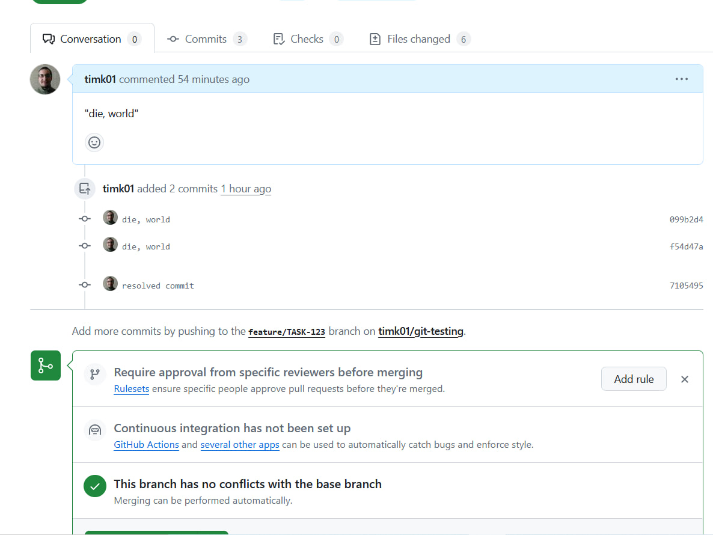   
-- итого    
_(здесь, правда, конфликт простой, но уже можно увидеть почему оно вообще происходит и что с этим делать, да)_

### Создаём ветку (чуть вернее)
_здесь и далее то, что происходило в лекции_   
убеждаемся что мы все еще на транке:  
`git branch`
```bash
git checkout -b feature/TASK-123 --no-track origin/trunk
```
`git checkout -b feature/TASK-123 origin/trunk`
(это создать ветку стандартно (потому и Б) но - **НО на основе удаленной ветки**, отсюда и _origin/trunk_)  
(сравни с `git checkout -b feature/TASK-123` - где **просто на основе какой-то** (при этом не обязательно мейна) ветки

теперь - ПОЧЕМУ это важно. а все потому что есть конфликты, в том числе и мы создаем на основе свежайшей (и нецелованной) как слеза юной девы, удаленной ветки  
с точки зрения репо - мы будем работать с последними изменениями, а так как мы предполагаем, что удаленный транк - самый последний, это существенно меньше возни в дальнейшей работе

теперь - что за зверь `--no-track`  
ноутрак главным образом - так и работает как "не отслежвать" - то есть у нас теперь ветка, которая никак не синхронизируется с главной и вообще про нее не знает    
что уменьшает конфликты, не нужно часто сливать/слиять (мерж/ребейз) и превращает ветку в ту самую сильную и независимую, которая все делает сама

_короче, с точки зрения транк-разработки - самое оно (но не без минусов, потому что сами можем наворотить делов)_

### Создаём ветку в origin
```bash
git push -u origin $(git branch --show-current)
```
`$(команда)` - это типа подзапроса в скуэле, сначала выполнится он  
_напомню, что мы уже сделали изменения к этому моменту и зафиксировали их_  
сама `$(git branch --show-current)` вернет не что иное, как текущую ветку, например так:    
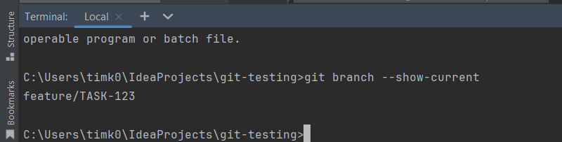  
а первая часть команды - это обычный пуш  
итого, выходит что:  
`git push -u origin $(git branch --show-current)`  
эквивалентно  
`git push -u origin feature/TASK-123`  
(делается это для удобства, чтобы когда ветки называются схоже, нельзя было опечататься - тем самым снижая возможные ошибки)

и да: полная команда в вин работать **не** будет, т.к. окошки не поддерживают прямую подстановку команд. `sadface`
как обходной путь, можно из баше:  
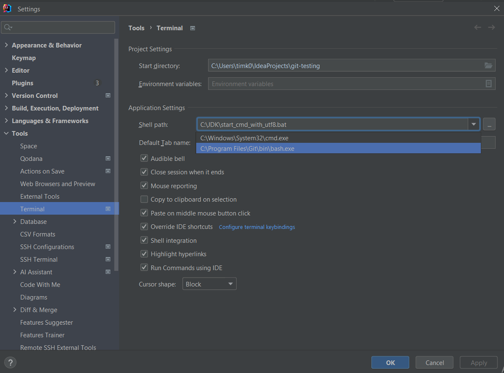
но, вам возможно придется переоткрыть идею и терминал снизу, тогда это чудо - заработает:


### Вносим изменения и добавляем их в отслеживаемые
(это мы итак знаем)
```bash
git add .
git commit -m TASK-123 Добавлена важная доработка
git push
```

### Готовим ветку к Pull Request №1 (начало)
Вернемся к пункту _### Создаём ветку (чуть вернее) выше_  
сделаем git pull, а как именно и почему - _смотреть ниже_.

### Лирическое отступление про fetch и pull
Например мы делаем `git fetch origin trunk` в нашу основную ветку  
Что делает эта команда ? - Она просто сливает изменения - вообще все, НО текущая ветка (напрмиер транк) - остается неизменной  
Или, эта команда просто _все загружает из удаленного репо, но НЕ мерджит_.

`git pull`, напротив работает как `fetch + merge`, и именно поэтому в предыдущем простом случае при пулле изменений в ветку feature/task-123 (находясь там), нам пришлось разруливать мердж-конфликт (напомню, на тот момент времени он у нас был)    
Иными словами, `git pull` универсальней и работает по принципу 2 в 1  
Есть нюанс:  
Если же мы сделаем просто `git pull` (без указания ветки), не факт что изменения ВСЕ будут слиты  
  
-- как например видно отсюда (ветку с какой сливается можно проверить `git branch -vv`)

#### Вмёрдживаем основную ветку к себе

```bash
git fetch
git merge origin/trunk
```

#### Делаем squash (один из способов, как по мне самый простой)
```bash
git reset --soft $(git merge-base trunk HEAD)
git commit -m "TASK-123 Добавлен один красивый коммит"
```
про первую команду детальней:  
`$(git merge-base trunk HEAD)` - смотри ниже на гарфик коммитов - находит общий предок для транка и новой ветки (123-нью)  
после чего, как порядочная функция, позвращает хеш этого коммита в функцию выше (она составная, если угодно)  
`git reset --soft 48ece5c` - получается как-то так, в итоге:
#### Посмотреть историю коммитов в виде графика
```bash
git log --graph --oneline --decorate
```
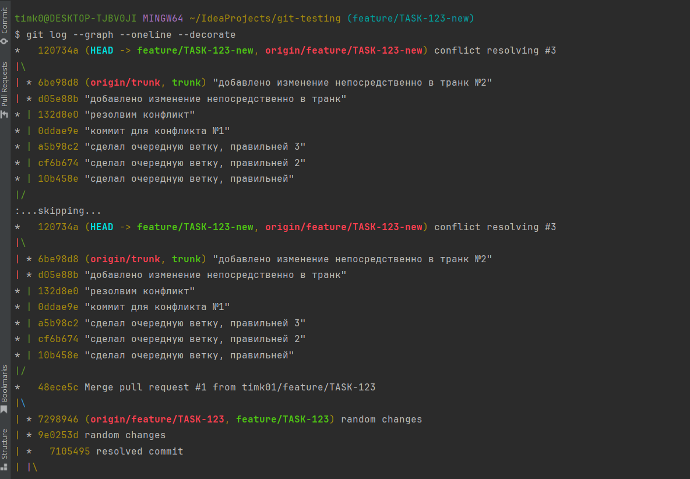  
выглядит так, например общий предок для веток - транка и feature/123-new - это:  
`*   48ece5c Merge pull request #1 from timk01/feature/TASK-123`  
-- дерево было таким...

`git reset --soft $(git merge-base trunk HEAD)`  
в итоге, после команды выше, стало таким:  
  
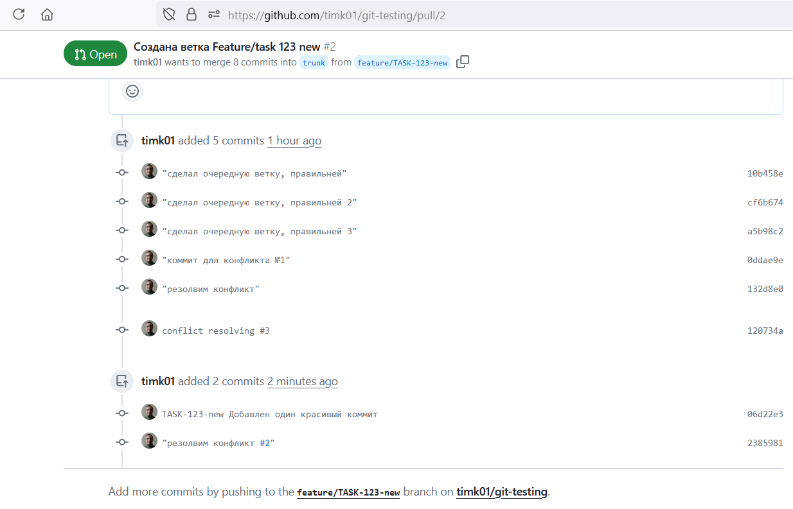  
-- в итоге, так (пришлось все же решать мердж-конфликт)  
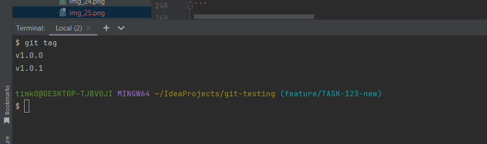

_Отступление про хардресет:_  
есть также `git reset --hard <commit>`  
-- так вот, использовать можно, но с осторожностью;  
работает по принципу ресет софт выше, но **удаляет коммиты после нашего (к коему ресетнулись) **

#### Пушим свои изменения
```bash
git push --force-with-lease  
```
Важно: я ранее делал просто `git push... ` и возникал конфликт.  
Почему после сквоша он вообще мог появляться ?  
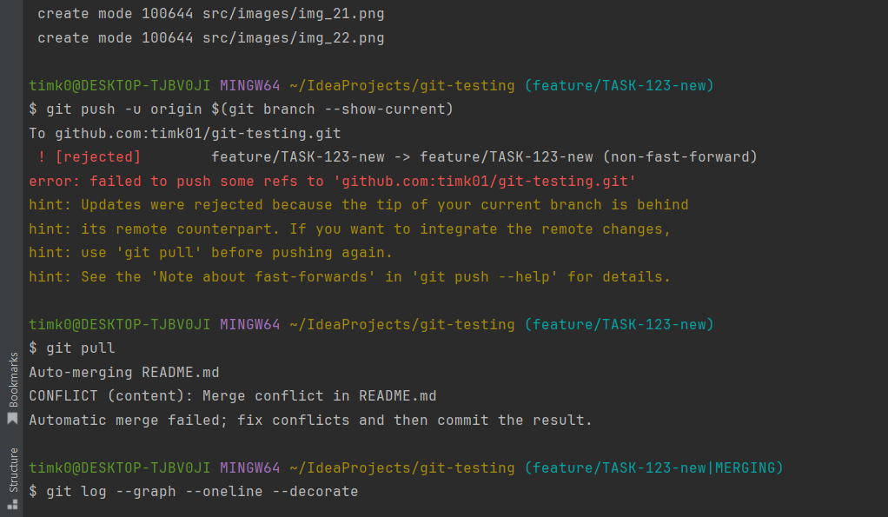
-- а все потому что в удаленном репо были изменения и при пуше их (новых изменений) туда козникал конфликт

`git push --force`  
при этой команде гиту абсолютно все равно на любые изменения в ветке куда мы пушим (были они иил нет - неважно) **- он их перезатрет нашим пушем**    
соответственно, и крайне опасно это делать с мейн иил важными ветками или если мы с ними работаем не одни (мы можем легко НЕ знать об этих изменениях!)  
пушфорс - полная перезапись указанной ветки; если угодно - это пуш-операция "на живую"

`git push --force-with-lease`  
-- при этой же команде будет выполнена проверка:  
если были изменения в ветке после `fetch` или `pull` - он не даст сделать пуш  
таким образом это как "собака на поводке" (отсюда и лиз) - мы сможем дотянуться только до своих пушей и не до каких других  
или, это пуш с предохранителем (или наркозом, усли угодно), который триггернется/сработает если что-то было сделано еще

## Полезные команды
_часть уже была, думаю не все нужно демонстрировать_

#### Показать список веток.
```bash
git branch -a
```
(это было в самом начале, здесь -a = all)

#### Изменить описание последнего коммита
```bash
git commit --amend -m "Описание коммита"
```
(можно сделать то же самое с помощью UI - над коммитом есть кнопочка amend, но она автоматически изменит последний коммит)

#### Посмотреть изменения между текущей веткой и trunk
```bash
git diff HEAD..origin/trunk
```
позволяет отслеживать разницу между ветками (что логично) - не слишком удобная как по мне фишка, напоминающая гитхаб файлс    
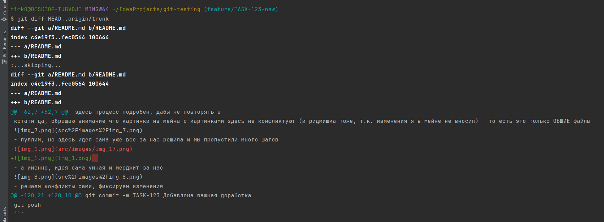

#### Удалить локальную и удалённую ветку
```bash
git push origin -d <имя_ветки>
git branch -D <имя_ветки>
```
_частично демонстрировалось мной в начале для удаленной ветки, для текущей - то ж самое_

#### Установить и запушить тэг
```bash
git tag <x.y.z>
git push origin --tags
```
Дополнительно: [семантическое версионирование](https://semver.org/lang/ru/)

Примеры использования:
`git tag -a <x.y.z> -m "Message for the tag"`  
`git tag -a v1.0.0 -m "Release version 1.0.0"`  
-- так например я создаю аннотированный тег; гит пихает его в базу к себеЮ с указанием тега и коммита (соответствующему тегу) `.git/refs/tags`  
`git push origin --tags`
-- запушил его удаленно
_Теги от ветки не зависят, если что (можно пушить откуда угодно)_

А как переключаться между ними ?  
Предположим, я создал 1 тег выше; потом сделал изменения, закоммитил их - и создал второй тег; оба запушил:  
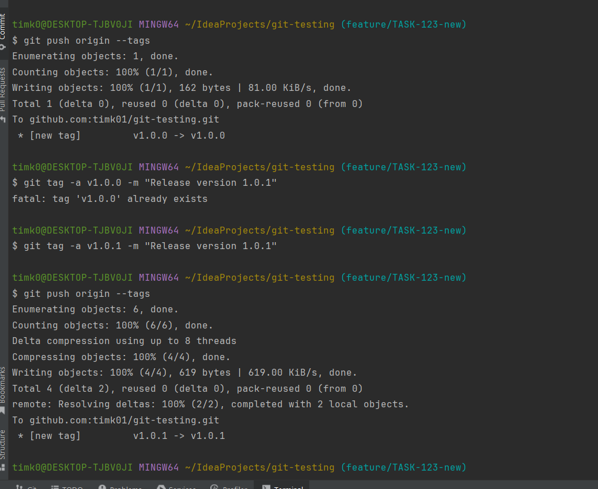  
`git tag`  
  
посмотреть теги  
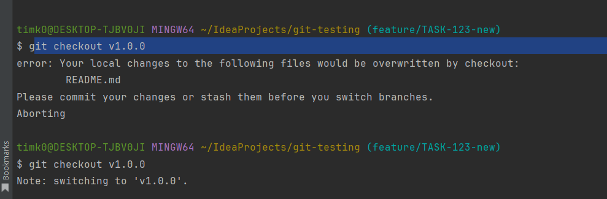  
переключаться - аккуратно, хотя изменения потерять нельзя, но запутаться - можно вполне легко (detached head например)

`git tag -d v1.0.0  
git push origin :refs/tags/v1.0.0`  
-- так можно удалять теги

В целом штука невероятно полезная.   
Кейс:  
тег можно рассматривать как слепок состояния всего приложения.    
например, я сделал какие-то мейджор-изменения, теганул их как 1.1.0, запушил - смерджили в транк, они не прошли (потребитель не хочет их), и мы откатываемся назад

мы сможем откатиться на версию 1.0.0 !

#### Перенести коммит из одной ветки в другую
```bash
git cherry-pick <хэш-коммита>
```

пример будет с 1 скрином, но суть понятна:  
мы берем изменения из одного коммита (по хешу) и вливаем в нашу ветку  
например, есть `feature/10` и `feature/9`  
`feature/10` - это ветка, образованная от `feature/9` и она зависит напрямую от нее, т.к. там используется апргейд функционала:  
в ф.9 было создание юзера и аккаунта, а в ф.10 - уже их получение

Допустим, у нас была `feature/6` - там мы реализовывали ранний функционал создания пользователя (и таким образом, все 3 ветки жили в один момент времени); после вливания этой ветки в транк, у нас логично будет конфликт  
и этот конфликт, что логично, распространится на обе ветки - и 9, и 10

что сделал я:  
решил конфликт в более ранней ветке ф. 10 (она оказалась более ранней по ошибке, но речь и не об этом, т.к. на тот момент времени состояние и 9, и 10 - было одинаковым)  
и чтобы быстрее решить конфликт + подтянуть изменения в ветку 9, черрипикнул коммит из ветки 10  
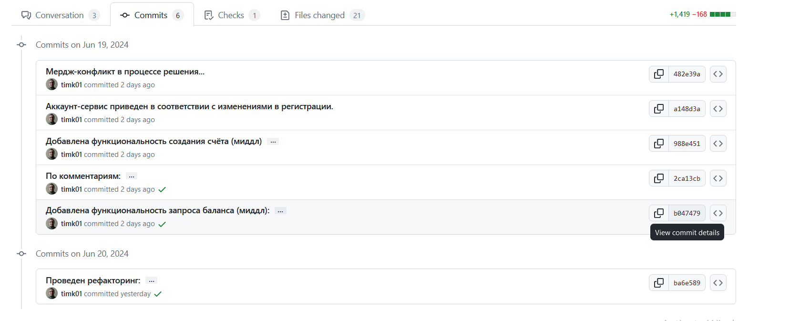  
на скрине - тот самый коммит, что я черрипикал после решения конфликта

## Линейная или нелинейная история: rebase или merge?


(если вкратце, оба пути хороши, но с гит ребейзом - можно долго и очень много ребейзить каждое изменение в каждом конфликте, что очень может прямо _сильно_ утомить)  
тут тоже без скринов - использовать мердж  
https://www.youtube.com/watch?v=0chZFIZLR_0

## Гит сташ (git stash)
Например, я работаю на 1 ветке - нужно срочно переключиться на другую и доделать там небольшую багулину  
вместо того, чтобы коммитить (хотя это тоже вполне возможный вариант) - я могу сделать стеш

Не хочется коммитить, если работа не завершена например, используемый код в одной ветке может быть переиспользуем, или просто не хотим гадить в коммиты  
Хотя, можно и совмещать оба подхода (и стеш, и коммиты) - вполне легко

`git stash save "feature/TASK-123-transfer"`  
`git checkout bugfix-branch (или ее создание через -b)`  
`--фикс багулины--  
--сохранение изменений, пуш--`  
`git checkout feature-branch`  
`git stash apply` // `git stash apply stash@{n}`
(`git stash list `для номера)

чуть для начала можно почитать здесь:  
https://ru.hexlet.io/courses/intro_to_git/lessons/git-stash/theory_unit

## Попрактиковаться в git

https://learngitbranching.js.org


